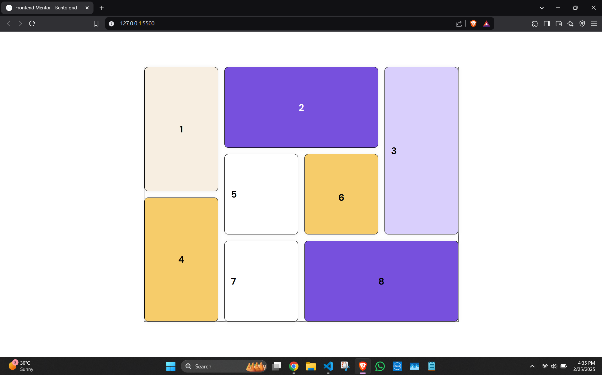

# Frontend Mentor - Bento grid [[Live Here](https://bento-grid-silk.vercel.app/)]

This is an implementation to the [Bento grid challenge on Frontend Mentor](https://www.frontendmentor.io/challenges/bento-grid-RMydElrlOj). 

## Overview

- This simple project was about implementing a webpage design using CSS Grid. 

### Screenshot

| Design                             | Implementation                           | 
|------------------------------------|------------------------------------------|
|    |   |

### Links

- [Live Site URL](https://bento-grid-silk.vercel.app/)

## My process

- I created the main grid layout first containing 8 cells inside a 6 X 4 grid.
- Here is the main layout of the page

- Followed by this the content for each cell was put and flexbox with wrap was used to make each cell's content responsive.

### Built with

- Semantic HTML5 markup
- CSS custom properties
- Flexbox
- CSS Grid
- Mobile-first workflow